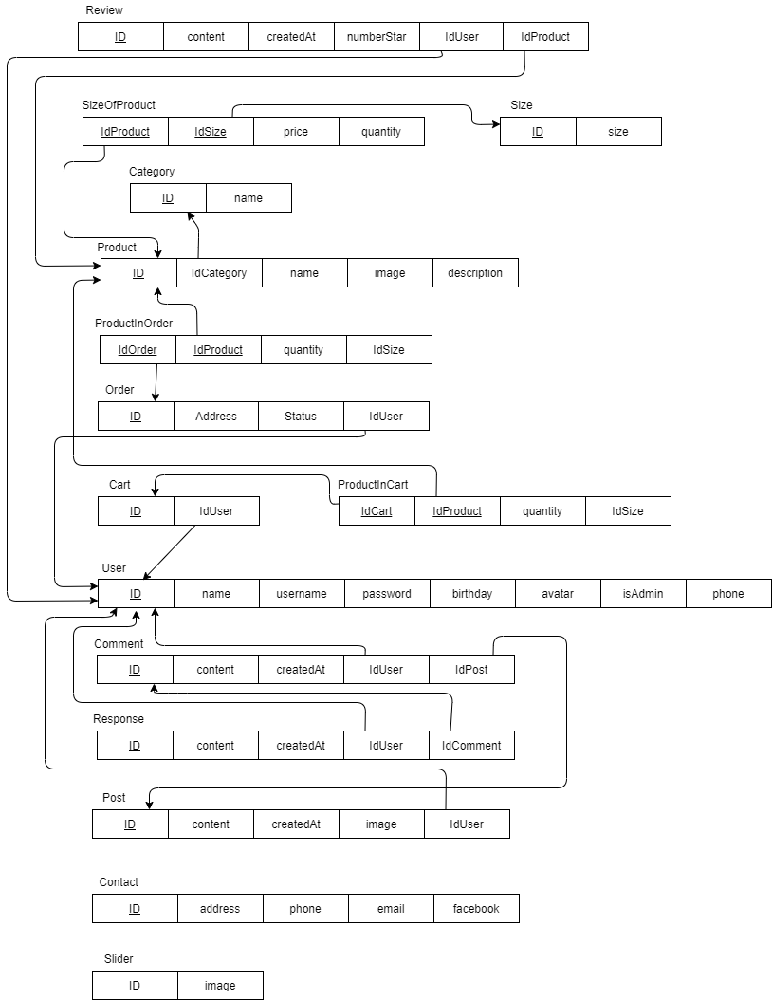
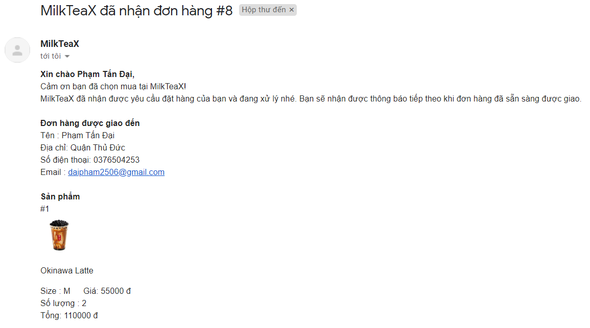

<h1>Cửa hàng trà sữa</h1>

Giới thiệu
==========

Giới thiệu đề tài
-----------------

-   Hiện thực website thương mại điện tử và sản phẩm cụ thể là trà sữa,
    cho phép người dùng sử dụng nhiều tính năng như xem danh sách trà
    sữa, đặt hàng, tìm kiếm sản phẩm, tạo bài đăng, thêm đánh giá, bình
    luận,...

-   Hiện thực các tính năng quản trị website như thêm tài nguyên của
    website, quản lý người dùng, xử lý các giao dịch, yêu cầu của người
    dùng.

Công nghệ sử dụng
-----------------

-   Ngôn ngữ: PHP, HTML, Javascript, CSS.

-   Database: MySQL

-   Thư viện:

    -   JQuery: Ngắn gọn, dễ sử dụng, dễ dàng để hiện thực các tác vụ
        như AJAX,...

    -   Boostrap: giúp xây dựng giao diện đẹp một cách nhanh chóng, dễ
        dàng.

-   Mô hình MVC: giúp phân chia code một cách rõ ràng, rành mạch, dễ
    hiện thực, dễ chỉnh sửa và dễ phát triển.

Kiến trúc hệ thống
==================

Thiết kế cơ sở dữ liệu
----------------------

### Mô hình ERD

### Mô hình relation

Cấu trúc mã nguồn
-----------------

-   Mã nguồn được thiết kế theo mô hình MVC gồm ba thành phần:

    -   Model: chứa các file tương tác với cơ sở dữ liệu.

    -   View: chứa các trang giao diện của website.

    -   Controller: chứa các file thực hiện việc điều hướng, chuyển
        trang,...

-   Thư mục public chứa tài nguyên của website như các file hình ảnh,
    các file css, các file js.

Các chức năng chính
===================

Người dùng là khách
-------------------

### Xem thông tin public trên trang web

-   Xem các trang public như trang chủ, giới thiệu, các dịch vụ, danh
    sách sản phẩm, thông tin liên hệ của website.

-   Tìm kiếm sản phẩm bằng cách nhập từ khóa vào ô tìm kiếm. Có hiện
    thực phân trang cho danh sách sản phẩm được hiển thị theo từ khóa.

### Đăng ký người dùng mới

-   Chỉ cần nhập các thông tin cần thiết như tên, email, mật khẩu là có
    thể đăng ký được tài khoản mới.

-   Các thông tin còn lại như địa chỉ, ngày sinh , số điện thoại, giới
    tính, ảnh đại diện... có thể được cập nhật sau khi đăng ký.

    

Người dùng là thành viên
------------------------

### Đăng nhập vào hệ thống

-   Người dùng sử dụng tài khoản đã đăng ký để đăng nhập vào hệ thống.

    

### Xem và cập nhật thông tin cá nhân

Chức năng này quản trị viên cũng có thể sử dụng Ấn vào avatar để xem
thông tin cá nhân

 

Ấn vào button Cập nhật thông tin để tiến hành cập nhật thông tin

### Thay đổi mật khẩu

Đổi mật khẩu thành công sẽ chuyển đến trang đăng nhập và người dùng đăng
nhập lại

### Quên mật khẩu

Người dùng có thể lấy lại mật khẩu đã quên qua email đã đăng ký trước
đó.

Yêu cầu lấy lại mật khẩu thành công

Tin nhắn cấp lại mật khẩu mới đã được gửi đến email của người dùng.

### Thêm sản phẩm vào giỏ hàng

-   Click vào biểu tượng giỏ hàng trên sản phẩm để thêm sản phẩm vào giỏ
    hàng.

    
    [fig:my~l~abel]

-   Ngoài ra, có thể thêm sản phẩm vào giỏ hàng ở trang chi tiết sản
    phẩm bằng cách click vào nút chọn mua.

    

### Xem giỏ hàng

-   Click vào button giỏ hàng trên header để xem chi tiết giỏ hàng và
    thực hiện các thay đổi nếu cần.

    

-   Có thể cập nhật lại địa chỉ, số lượng, size của sản phẩm, hoặc cũng
    có thể xóa sản phẩm ra khỏi giỏ hàng.

### Đặt hàng

-   Click vào nút đặt hàng ở giỏ hàng để tiến hành đặt hàng.

-   Khi đặt hàng thành công thì tất cả sản phẩm trong giỏ hàng sẽ được
    xóa đi và chuyển vào trong đơn hàng, đơn hàng mới được tạo ra.

### Xem danh sách đơn hàng

-   Hiển thị danh sách các đơn đặt hàng.

-   Hiển thị các thông tin của đơn đặt hàng bao gồm sản phẩm, tổng tiền,
    trạng thái đơn hàng,...

    

### Thêm đánh giá cho sản phẩm

-   Thực hiện việc đánh giá và xem đánh giá tại trang chi tiết sản phẩm

    

    1.  Số sao đánh giá trung bình và tổng số đánh giá

    2.  Nút thêm đánh giá mới

-   Thêm đánh giá mới

    

-   Các đánh giá của khách hàng

    
    \
    Khách hàng có thể xóa đi đánh giá của chính mình với nút xóa.

-   Xóa đánh giá thành công

    

### Tạo, xóa, chỉnh sửa bài đăng

-   Click vào button thêm bài đăng mới để tạo bài đăng mới.

-   Tạo bài đăng mới

    

-   Sau khi thêm bài đăng mới thành công, thì bài đăng sẽ được hiển thị
    lên danh sách các bài đăng, có hiện thực phân trang cho việc hiển
    thị danh sách các bài đăng.

    

-   Chỉ có người tạo ra bài đăng mới có quyền chỉnh sửa và xóa bài đăng
    đó.

    
    

### Viết bình luận

-   Người dùng có thể viết các bình luận vào bài đăng của mình hoặc bài
    đăng của người khác.

-   Người dùng cũng có thể trả lời bình luận của các người dùng khác tại
    bài đăng của chính mình hoặc bất kỳ bài đăng nào khác.

-   Sử dụng AJAX cho việc cập nhật lại danh sách bình luận, tránh việc
    tải lại cả website.

-   Người dùng chỉ có thể xóa bình luận của chính mình.

    

Người dùng là quản trị viên
---------------------------

### Thêm sản phẩm mới, chỉnh sửa, xóa sản phẩm

-   Trang quản lí sản phẩm

    

-   Trang thêm sản phẩm mới

    

-   Thêm sản phẩm thành công

    

-   Trang cập nhật sản phẩm

    
-   Cập nhật sản phẩm thành công

    

-   Xóa sản phẩm

    

-   Xóa sản phẩm thành công

    

### Cập nhật thông tin cửa hàng

-   Ấn vào button Sửa thông tin ở phẩn footer

    

-   Trang cập nhật thông tin liên hệ

    

-   Cập nhật thành công

    

### Xem thông tin người dùng, xóa người dùng

Trang quản lý người dùng

Chọn người dùng muốn xóa

Xóa user thành công

### Kiểm tra thông tin đơn hàng và đánh dấu trạng thái của đơn hàng

Trang quản lý đơn hàng

Chọn vào vùng màu xanh lam để thay đổi trạng thái đơn hàng

Thay đổi trạng thái đơn hàng thành công

### Gửi email thông báo đến user tình trạng đơn hàng

Email thông báo xác nhận đơn hàng

Email thông báo đơn hàng đang được vận chuyển

Email thông báo đơn hàng đã được giao thành công

Cài đặt
=======

-   Website chạy trên ứng dụng Xampp.

-   Phiên bản PHP hỗ trợ: PHP 7.4.7

Tài liệu tham khảo
==================

-   <https://www.w3schools.com/php/php_ref_overview.asp>

-   <https://dev.mysql.com/doc/>

-   <https://www.php.net/manual/en/function.file-get-contents.php>

-   <https://api.jquery.com/>

